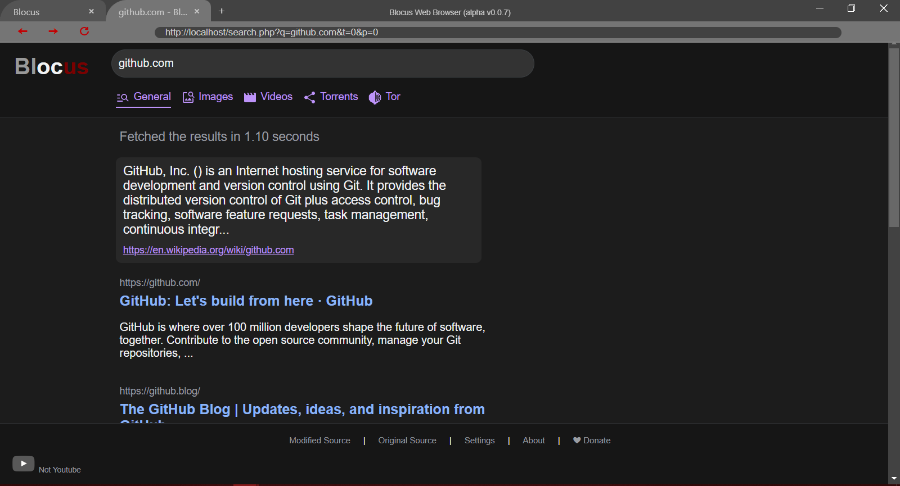

# Blocus Web Browser ***-- A work in progress Alpha 0.0.7***


- Tired of being tracked?
- Try the new secure web browser with configurable privacy front-ends (coming soon).
Made with [Electron](https://github.com/electron/electron) in pure JS (without node integration).

## Features
- Simple and fast responsive
- No cache
- No buisiness with privacy
- No tracking
- Integrated ad blocker (uBlock Origin)
- Isolated contextes for security
- Some bugs (working on... :wink:)

## Future Features (coming not too soon)
- Config panel
- Better design (not for now)
- All included privacy protection
- Design customization (general themes and the possibility to create and add custom themes)
- Proxy redirection for all requests (configurable)
- Possibility to add custom OpenVPN profile(s)
- Will try to make the Internet free again!
- We do not need any privacy policy beacause wo do not collect any data!
- Other fun things are coming, like proxies, webmail and more...

## Install

- Testing installation
    - [Releases](https://github.com/blocus-org/blocus-web-browser/tags) (Windows & Debian)

- Dev installation
    - [Windows](#installwin)
    - [Linux](#installdeb)
    - [MacOs](#installmac) (coming soon)

## Contribution

- Please read the [code of conduct](https://github.com/Zqfd/blocus-web-browser/blob/main/CODE_OF_CONDUCT.md)
- Then go to the [contribution area](https://github.com/Zqfd/blocus-web-browser/blob/main/CONTRIBUTING.md)
## Related repos

- [Blocus Search Engine](https://github.com/Zqfd/blocus-search-engine)
- Blocus Invidious instance (not-ytb.blocus.sx). wip
- Blocus WebMail (Postfix TLS Swiss Server with opensource GUI). wip
- Blocus ChatRoom (WebApp PHP instant messaging with encrypted database). wip

# Developpement

## Compatibility
- Works on Windows 10.
- Not yet tested on Windows 11.
- Works on Debian
- Not yet tested on MacOs.

## <a name="install">Installation<a>

#### <a name="installwin">Install on Windows 10</a><br><span style="font-size:10px;">(Git Bash)</span>

- Download [Nodejs](https://nodejs.org/en/download/)18.x.x for windows. This setup will also install npm.
- Check if it's ok:
```sh
node --version
> v18.14.2 # Or Later
```
```sh
npm --version
> 9.5.0 # Or later
```
- Theses commands will clone the repository and install dependencies:<br>
```sh
git clone https://github.com/Zqfd/blocus-web-browser.git
cd blocus-web-browser
npm install
```
- Run the app:
```sh
npm start
```
- Make executables with electron/forge (you need a Linux environnement for making an executable for Linux):
```sh
npm run make --arch yourarch --platform yourplatform 

# Without options for autodetection
```

#### <a name="installdeb">Install on Linux</a> (*debian*)
- Instal rpm binaries:
```sh
sudo apt install rpm -y
```
- Be sure you run at least Nodejs version 18.x.x.x:
```sh
node --version
> v18.14.2 # Or later
```
- Be sure you run the last version of npm:
```sh
npm --version
> 9.5.0 # Or later
```
- Theses commands will clone the repository and install dependencies:
```sh
git clone https://github.com/Zqfd/blocus-web-browser.git
cd blocus-web-browser
npm install
```
- Run the app:
```sh
npm start
```
- Make executables with electron/forge (you need a Windows environnement for making a squirell installer):
```sh
npm run make --arch yourarch --platform yourplatform 

# Without options for autodetection
```

